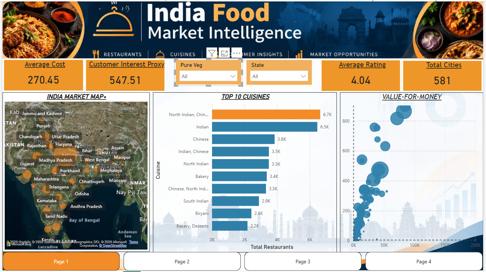
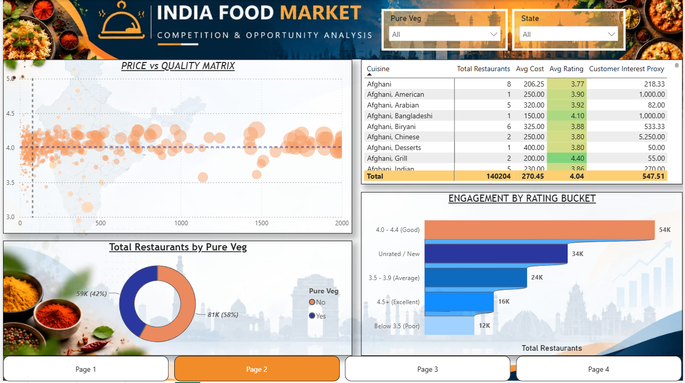
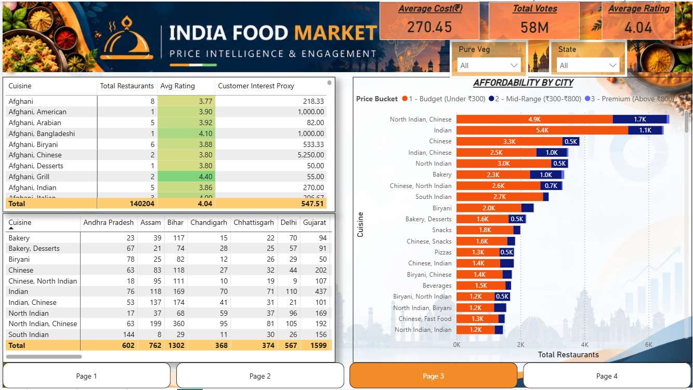
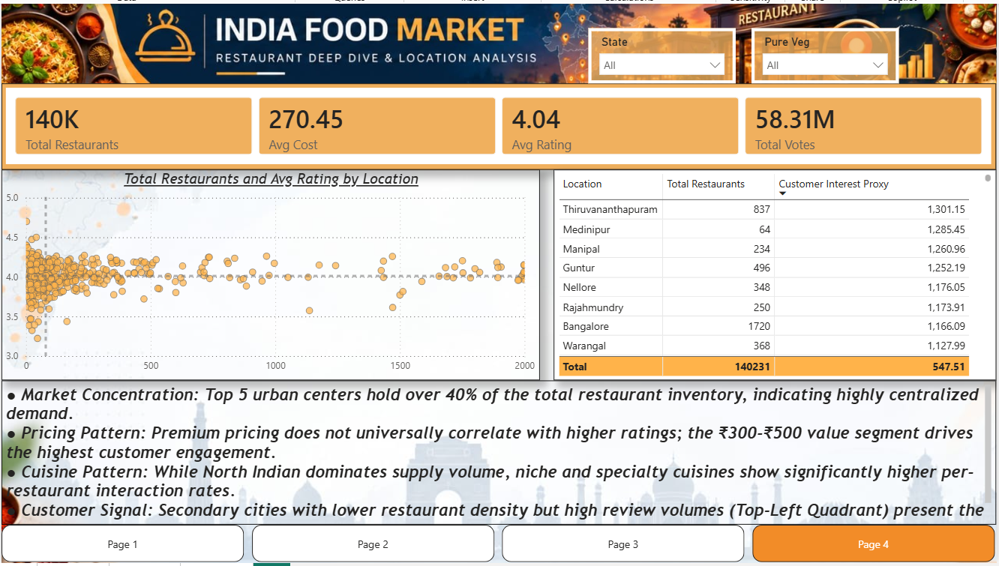

# 📊 India Food Market Intelligence & Opportunity Analysis System

An end-to-end Power BI Business Intelligence solution built to analyze **140,000+ Swiggy food listings** across India. This system transforms raw restaurant data into strategic market intelligence for cloud kitchen operators, investors, and food-tech analysts.

---

## 📌 Executive Summary

* **Data Scale:** 140,204 restaurants analyzed across 581 cities in India.
* **Key Metrics:** ₹270.45 Average Cost for Two | 4.04 Average Rating | 58.31M+ Total Customer Votes.
* **Primary Objective:** Identify unserved/underserved geographic markets, analyze price-to-quality relationships, and pinpoint optimal expansion zones.

---

## 🖥️ Dashboard Architecture & Views

### Page 1: Executive Market Overview
* **Focus:** High-level market KPIs, spatial density across Indian states, top cuisines, and value distribution.
* **Key Visuals:** Spatial Bubble Map, Bar Chart for Top 10 Cuisines, Price vs Quality Scatter plot.



---

### Page 2: Competition & Opportunity Analysis
* **Focus:** Identifying market saturation vs. customer engagement proxies.
* **Key Visuals:** Price vs. Quality Matrix, Pure-Veg Market Share (58% Non-Veg vs 42% Pure-Veg), Rating Bucket Distribution (54K restaurants in 4.0-4.4 bracket).



---

### Page 3: Price Intelligence & Customer Engagement
* **Focus:** Price bucket distribution and city-cuisine matrix.
* **Key Visuals:** Cuisine x State Matrix, City Affordability Stacked Bar Chart (Budget <₹300, Mid-Range ₹300-₹800, Premium >₹800).



---

### Page 4: Deep Dive & Executive Strategy
* **Focus:** Actionable business recommendations and location intelligence.
* **Key Insights:** Market concentration dynamics, pricing-to-rating correlations, and target expansion quadrants.



---

## 🛠️ Key DAX Measures

### 1. Bulletproof Average Rating
```dax
Avg Rating = 
AVERAGEX(
    FILTER(
        'PowerBI_Swiggy_Master', 
        'PowerBI_Swiggy_Master'[rating_clean] > 0
    ),
    'PowerBI_Swiggy_Master'[rating_clean]
)
2. Customer Interest Proxy
Code snippet
Customer Interest Proxy = 
AVERAGEX(
    FILTER(
        'PowerBI_Swiggy_Master', 
        'PowerBI_Swiggy_Master'[votes_clean] > 0
    ),
    'PowerBI_Swiggy_Master'[votes_clean]
)
💡 Strategic Business Takeaways
Market Concentration: Top 5 urban centers account for over 40% of total restaurant listings, indicating centralized food delivery demand.

Pricing Signal: Premium pricing does not guarantee higher ratings; maximum customer interaction is concentrated in the ₹300–₹500 budget range.

Expansion Strategy: Tier-2/Tier-3 cities showing low restaurant density but high review volume present low-risk, high-return opportunities for new cloud kitchens.

🚀 How to Run Locally
Clone this repository:

Bash
git clone [https://github.com/your-username/India-Food-Market-Intelligence.git](https://github.com/your-username/India-Food-Market-Intelligence.git)
Open India_Food_Market_Intelligence.pbix in Power BI Desktop.

Ensure data sources are refreshed if modifying underlying CSVs.

👨‍💻 Developed By
Sonu Kumar Thakur

B.Tech, Computer Science and Engineering

LinkedIn

GitHub

Feel free to reach out for collaborations or queries regarding this dashboard!
